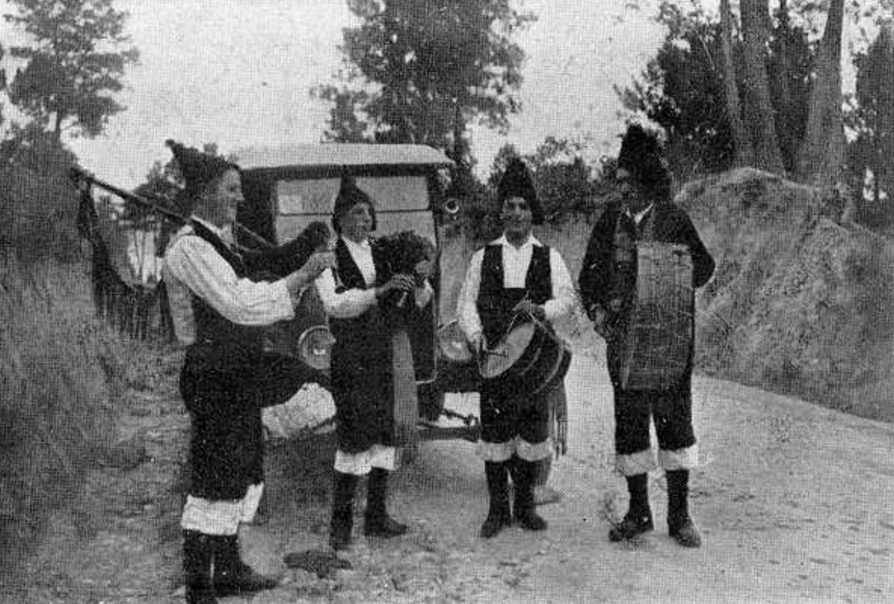

# TODO

me quedao con los plots de sparese, mirar:
 - pasar argmunetos shard para cargar 
 - nombre de png guay

luego invertir

---

descubrimiento: menos or es mejor (optimo es 0 o 0.2)

---

experimentos recientes

saque rfmid de https://www.kaggle.com/datasets/andrewmvd/retinal-disease-classification?resource=download

- en la carpeta noseque pos solo deberias tener dos: enana y enana no pos
- en la carpeta 1vs7 vas a tener la ostia y vas a tener shared dict antiguos que no valen. quedarse con los shared dict nuevos y los no shared dict antiguos

---

Ideas posibles:
    - Visualizar mapas de atención strided
    - Weight sharing del diccionario.
    - Desacoplar positional embedding?
    - Posibilidad de cruzar ordenes entre entrenamiento y transferencia? es decir, el U es el mismo? El U puede ser shared?

---

data:
 -comprobar gaussiana

red:  
 - Inversa de clase
 - Inspeccionar subsclases capa anterior. 

evaluacion:
 - distintos parmetros ista y probar f: x if |x| > 0 else 0
 - cada ciertos epochs calcular dice
 - poner  stride e interpolacion a script de evaluacion
 - accuracy tiene un nuevo amigo que es roc. una grafica pa el y se reporta conjunto al accuracy 

software:
 - gestionar bien el caso en el que no hay D.A.
 - pasar a gallego, ordenar argparses, refactorizar
 - script limpiar (que printee cuantos archivos y espacio borro) 

plots:
- log log 
- val loss

xeral:
 - limpiar maquina

---

