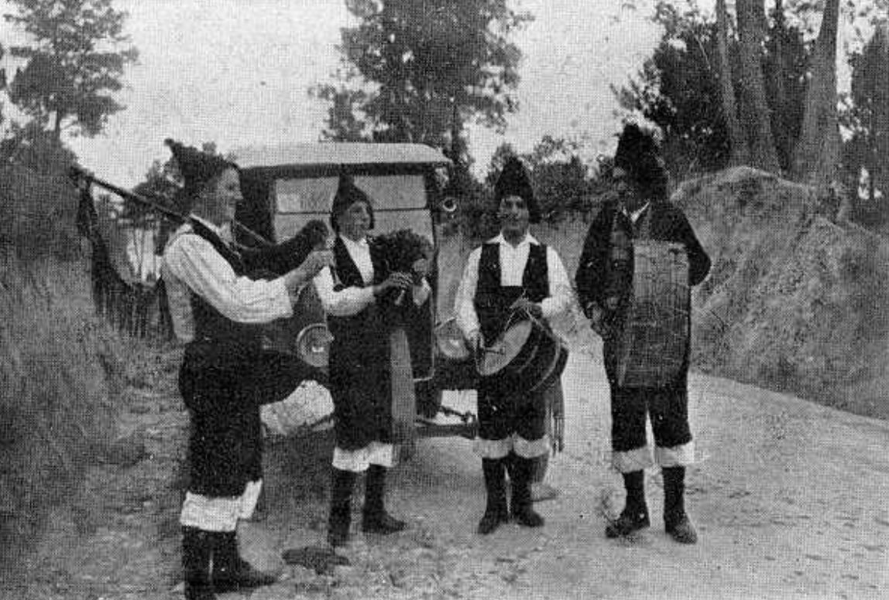

- imprimir 5 paginas sparse dict y redunet
- script traer pesos
- el primer orden devuelve $Z_{n\times d}$, donde $Z_i$ es la combinacion lineal de todos los $Z_j$ donde el peso de ponderacion $\lambda_{ij} = U Z_i \dot U Z_j$, el segundo orden devuelve$Z_{n\times d}$, donde $Z_i$ es la combinacion lineal de todos los $UZ_j$ (U es un hendomorfismo) donde el peso de ponderacion $\lambda_{ij} = U Z_i \dot U Z_j$

- actualmente el forward de la atencion tiene un argumento `return att` que en caso de 1er orden devuelve la attencion tal cual yi ma y en el 2do orden devuelve la segunda cabeza. lo suyo seria que en 2nd orden devuelva las dos cabezas y que sea el mapas atencion el que hace un if order y gestiona todo: en caso de segundo orden pedir y usar ambas cabezas
- saturacion plot imagenet
- revisar `resume`
- preguntar a rouco adam bb regresion
- `&` prompt decir rouco
- drawio
- investigar nohup, como hacer que guarde todo (rm?)
- acc5 en los plot
- no plot de sparsity y crr plotealas cabezas por separado

- plot de loses del grid search del patch embeding

